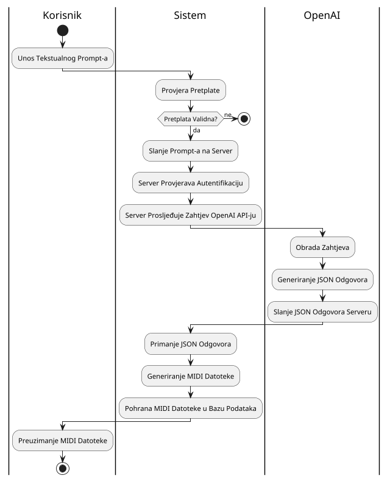

# 2. Dijagrami Aktivnosti

```plantuml
@startuml

scale 640 width

|Korisnik|
start
:Unos Tekstualnog Prompt-a;

|Sistem|
:Provjera Pretplate;
if (Pretplata Validna?) then (da)
    :Slanje Prompt-a na Server;
else (ne)
    stop
endif

:Server Provjerava Autentifikaciju;
:Server Prosljeđuje Zahtjev OpenAI API-ju;

|OpenAI|
:Obrada Zahtjeva;
:Generiranje JSON Odgovora;
:Slanje JSON Odgovora Serveru;

|Sistem|
:Primanje JSON Odgovora;
:Generiranje MIDI Datoteke;
:Pohrana MIDI Datoteke u Bazu Podataka;

|Korisnik|
:Preuzimanje MIDI Datoteke;
stop

@enduml

```