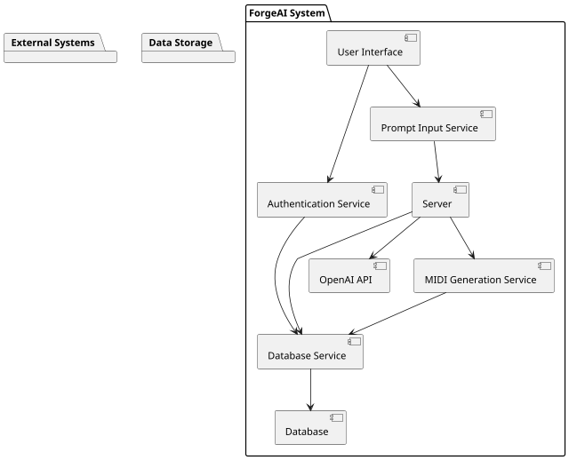

# 5. Dijagrami Komponenti

```plantuml
@startuml

scale 640 width

package "ForgeAI System" {
    [User Interface] --> [Authentication Service]
    [User Interface] --> [Prompt Input Service]
    
    [Authentication Service] --> [Database Service]
    [Prompt Input Service] --> [Server]
    
    [Server] --> [OpenAI API]
    [Server] --> [Database Service]
    
    [Database Service] --> [Database]
    
    [Server] --> [MIDI Generation Service]
    [MIDI Generation Service] --> [Database Service]
}

package "External Systems" {
    [OpenAI API]
}

package "Data Storage" {
    [Database]
}

@enduml

```