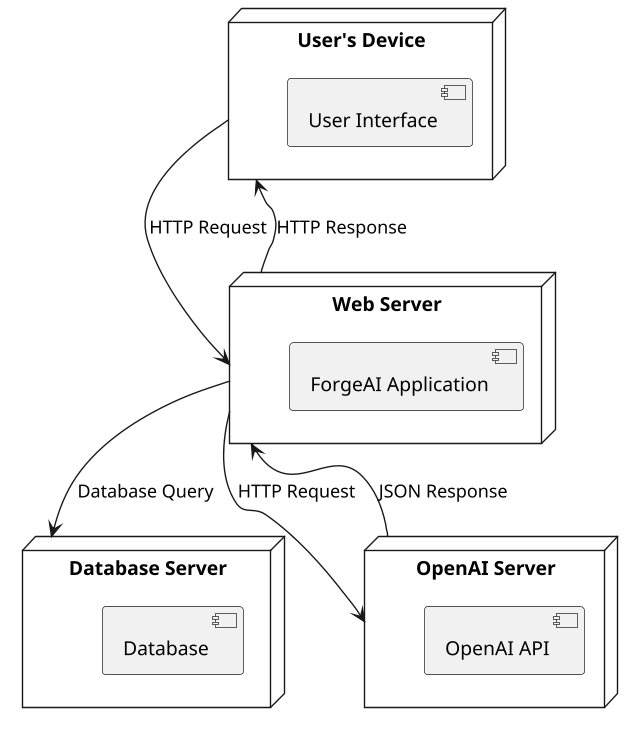

# 8. Deployment Dijagrami

```plantuml
@startuml

scale 640 width

node "User's Device" as UserDevice {
    [User Interface]
}

node "Web Server" as WebServer {
    [ForgeAI Application]
}

node "Database Server" as DatabaseServer {
    [Database]
}

node "OpenAI Server" as OpenAIServer {
    [OpenAI API]
}

UserDevice --> WebServer : HTTP Request
WebServer --> DatabaseServer : Database Query
WebServer --> OpenAIServer : HTTP Request
OpenAIServer --> WebServer : JSON Response
WebServer --> UserDevice : HTTP Response

@enduml

```