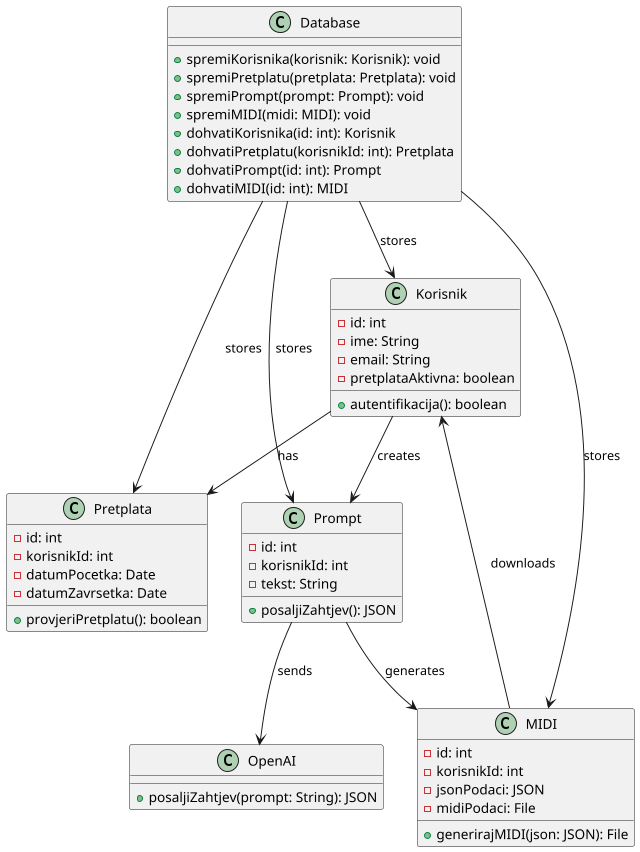

# 4. Dijagrami Klasa

```plantuml
@startuml

scale 640 width

class Korisnik {
-id: int
-ime: String
-email: String
-pretplataAktivna: boolean
+autentifikacija(): boolean
}

class Pretplata {
-id: int
-korisnikId: int
-datumPocetka: Date
-datumZavrsetka: Date
+provjeriPretplatu(): boolean
}

class Prompt {
-id: int
-korisnikId: int
-tekst: String
+posaljiZahtjev(): JSON
}

class OpenAI {
+posaljiZahtjev(prompt: String): JSON
}

class MIDI {
-id: int
-korisnikId: int
-jsonPodaci: JSON
-midiPodaci: File
+generirajMIDI(json: JSON): File
}

class Database {
+spremiKorisnika(korisnik: Korisnik): void
+spremiPretplatu(pretplata: Pretplata): void
+spremiPrompt(prompt: Prompt): void
+spremiMIDI(midi: MIDI): void
+dohvatiKorisnika(id: int): Korisnik
+dohvatiPretplatu(korisnikId: int): Pretplata
+dohvatiPrompt(id: int): Prompt
+dohvatiMIDI(id: int): MIDI
}

Korisnik --> Pretplata : "has"
Korisnik --> Prompt : "creates"
Prompt --> OpenAI : "sends"
Prompt --> MIDI : "generates"
MIDI --> Korisnik : "downloads"
Database --> Korisnik : "stores"
Database --> Pretplata : "stores"
Database --> Prompt : "stores"
Database --> MIDI : "stores"

@enduml
```