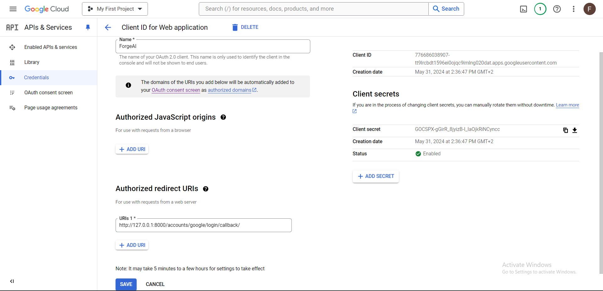
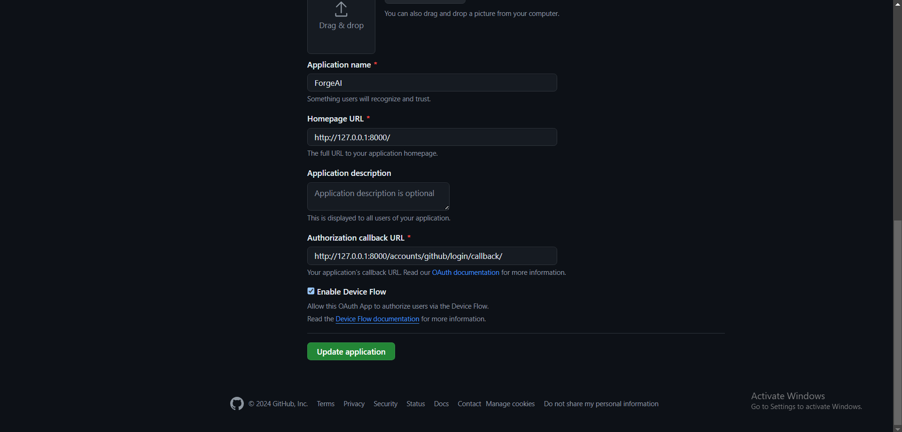
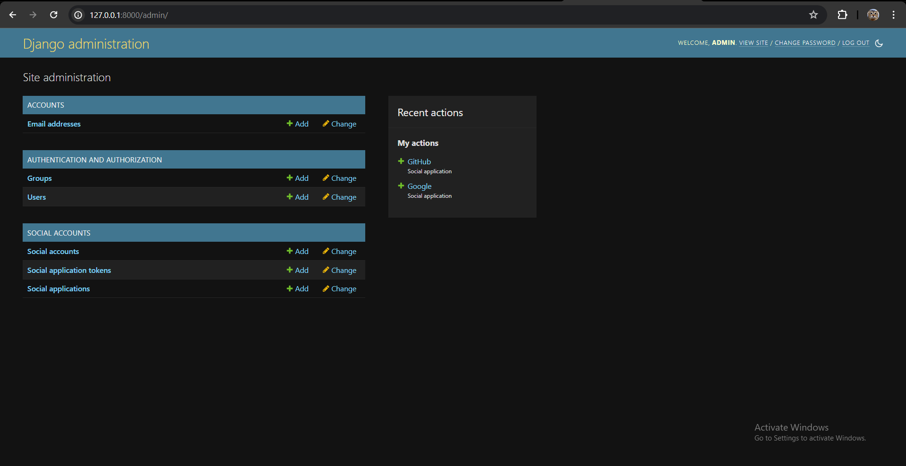
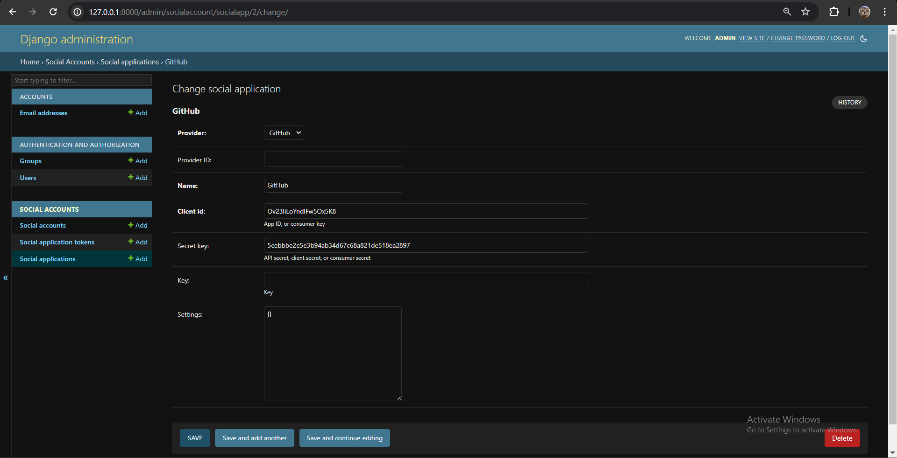
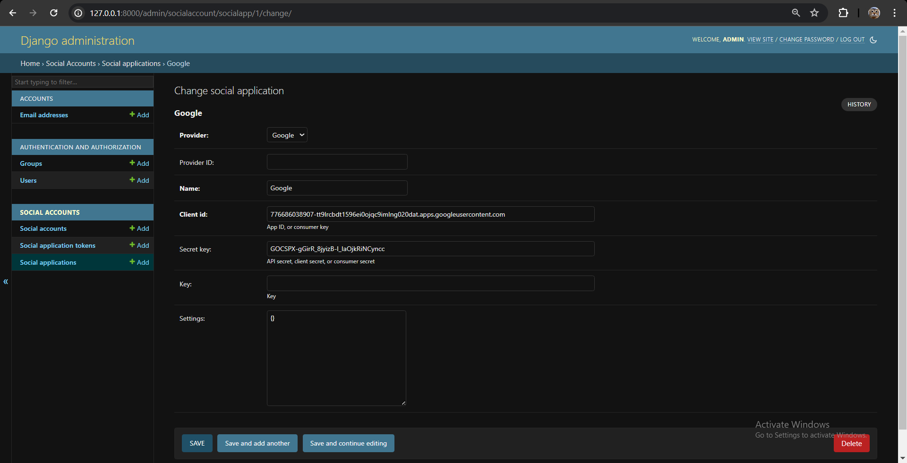

# 11.3 Dodavanje Google i GitHub Autentifikacije

Instalacija potrebnih paketa:
```shell
pip install "django-allauth[socialaccount]"
```

Dodavanje aplikacija u `settings.py`:
```python
INSTALLED_APPS = [
  ...
  'allauth.socialaccount.providers.google',
  'allauth.socialaccount.providers.github',
  ...
]
```






Kroz admin dashboard se može uspostaviti autentifikacija putem Google i GitHub providera.







## Dokumentacija za Allauth

[Allauth Dokumentacija](https://docs.allauth.org/en/dev/socialaccount/index.html)

> Unutar `/venv` direktorija nalaze se templates za Allauth stranice:
```
/ForgeAI                  # Root repozitorija
  ├── /venv
  │  ├── pyvenv.cfg
  │  ├── /Lib
  │  │  ├── /allauth
  │  │  │  ├── /templates
  │  │  │  │  ├── (HTML Templates)
```

Templates se mogu stilizirati na osnovu [ove dokumentacije](https://docs.allauth.org/en/latest/common/templates.html).
