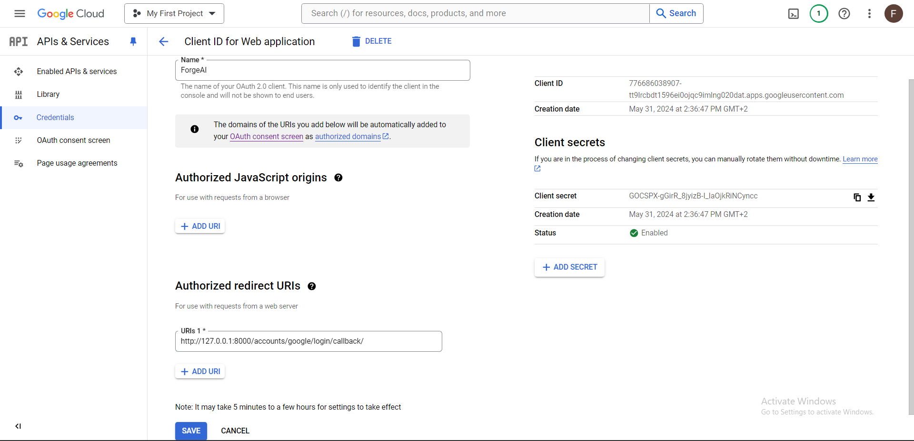
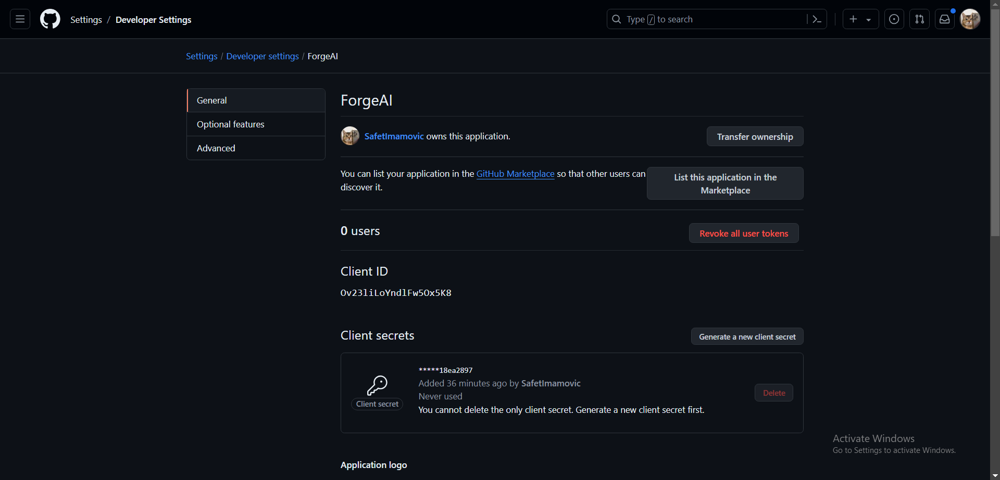
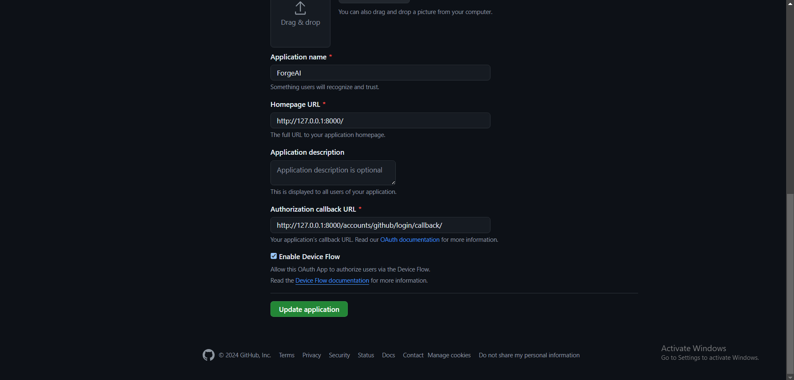
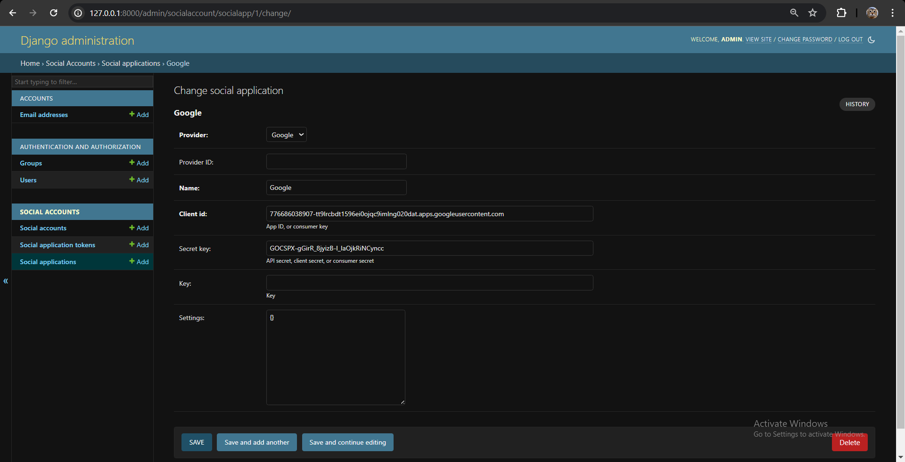

# 11.3 Dodavanje Google i GitHub Autentifikacije

Instalacija potrebnih paketa:
```shell
pip install "django-allauth[socialaccount]"
```

Dodavanje aplikacija u `settings.py`:
```python
INSTALLED_APPS = [
  ...
  'allauth.socialaccount.providers.google',
  'allauth.socialaccount.providers.github',
  ...
]
```







Kroz admin dashboard se može uspostaviti autentifikacija putem Google i GitHub providera.




## Dokumentacija za Allauth

[Allauth Dokumentacija](https://docs.allauth.org/en/dev/socialaccount/index.html)

> Unutar `/venv` direktorija nalaze se templates za Allauth stranice:
```
/ForgeAI                  # Root repozitorija
  ├── /venv
  │  ├── pyvenv.cfg
  │  ├── /Lib
  │  │  ├── /allauth
  │  │  │  ├── /templates
  │  │  │  │  ├── (HTML Templates)
```
<warning>
    Ove templates se ne mogu mijenjati direktno, već se moraju kopirati u `/templates` direktorij projekta.
</warning>
<note>
    Ali su zato vec kopirane allauth elements u <code>/templates/allauth</code> gdje se individualni elementi mogu mijenjati.
    To osgiurava konziostenciju izmedju svih stranica:
</note>

```
/ForgeAI                  # Root repozitorija
      ├── /ForgeAI 
      │  ├── /templates
      │  │  ├── /allauth
      │  │  │  ├── /elements
      │  │  │  │  ├── alert.html
      │  │  │  │  ├── h1.html
      │  │  │  │  ├── button.html
      │  │  │  │  ├── ...
      │  │  │  ├── /layouts
      │  │  │  │  ├── base.html
      │  │  │  │  ├── entrance.html
      │  │  │  │  ├── manage.html
```

>elementi kao sto su `alert.html`, `h1.html`, `button.html` i `base.html` se mogu mijenjati kako bi se prilagodili dizajnu aplikacije.

Templates se mogu stilizirati na osnovu [ove dokumentacije](https://docs.allauth.org/en/latest/common/templates.html).
