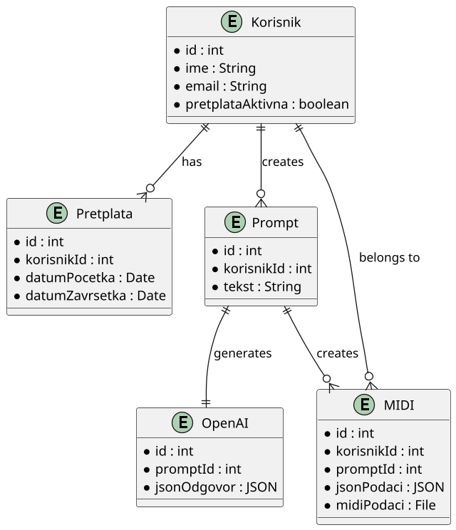

# 6. ER Dijagrami

```plantuml
@startuml

scale 640 width

entity Korisnik {
    * id : int
    * ime : String
    * email : String
    * pretplataAktivna : boolean
}

entity Pretplata {
    * id : int
    * korisnikId : int
    * datumPocetka : Date
    * datumZavrsetka : Date
}

entity Prompt {
    * id : int
    * korisnikId : int
    * tekst : String
}

entity OpenAI {
    * id : int
    * promptId : int
    * jsonOdgovor : JSON
}

entity MIDI {
    * id : int
    * korisnikId : int
    * promptId : int
    * jsonPodaci : JSON
    * midiPodaci : File
}

Korisnik ||--o{ Pretplata : "has"
Korisnik ||--o{ Prompt : "creates"
Prompt ||--|| OpenAI : "generates"
Prompt ||--o{ MIDI : "creates"
MIDI }o--|| Korisnik : "belongs to"

@enduml

```