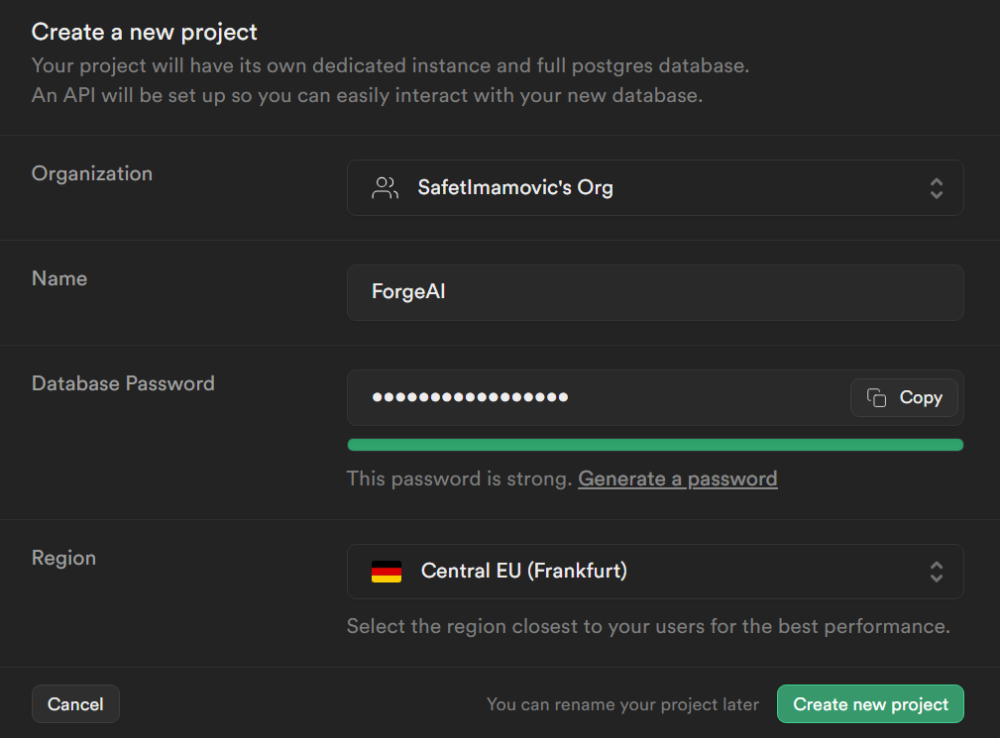
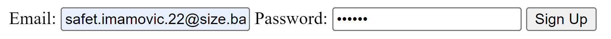
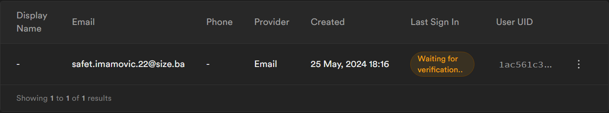
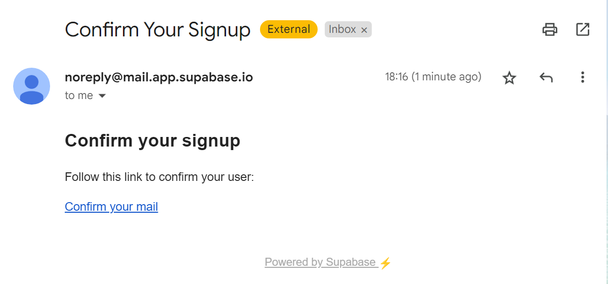
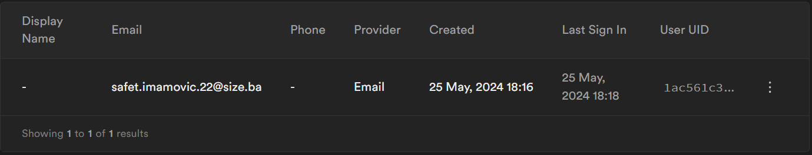
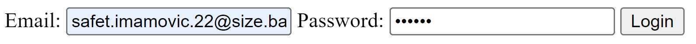

# Postavke Projekta i Supabase Integracija

## Inicijalizacija Projekta

- **Postavljanje Virtuelnog Okruženja**: Kreirano je virtuelno okruženje nazvano `ForgeAI_env` kako bi se izolirale zavisnosti za ovaj projekat. To osigurava da su zavisnosti projekta izolirane od drugih Python projekata.

```Shell
pip install virtualenv
```

```Shell
virtualenv ForgeAI_env
```

```Shell
ForgeAI_env\Scripts\activate
```

- **Instalacija Django-a**: Django, Python web okvir, instaliran je unutar virtuelnog okruženja kako bi se olakšao razvoj web aplikacije.

```Shell
pip install django
```

- **Kreiranje Django Projekta i Aplikacije**: Iniciran je Django projekt nazvan `ForgeAI_django`, i aplikacija nazvana `backend_logika` kreirana je unutar projekta. Ova aplikacija će rukovati backend logikom naše aplikacije.

```Shell
django-admin startproject ForgeAI_django
```

```Shell
cd ForgeAI_django
```

```Shell
python manage.py startapp backend_logika
```

## Integracija sa Supabase-om

- **Postavljanje Supabase Projekta**: Kreiran je Supabase projekt nazvan `ForgeAI`, koristeći njegove moćne backend mogućnosti uključujući funkcionalnosti u realnom vremenu i ugrađenu autentifikaciju. API ključevi i URL neophodni za integraciju dobijaju se iz postavki Supabase projekta.



- **Konfiguracija Okruženja**: Supabase kredencijali sigurno su pohranjeni u `.env` datoteci na korijenu projekta. To osigurava da osjetljive informacije kao što su API ključevi i URL-ovi ostanu privatni i ne izloženi u kontrolnoj verziji.

```Shell
SUPABASE_URL=supabase_url_projekta
SUPABASE_KEY=supabase_api_kljuc_projekta
```

- **Instalacija Python-Dotenv-a**: Paket `python-dotenv` je instaliran kako bi olakšao učitavanje varijabli okruženja iz `.env` datoteke u Django postavkama.

```Shell
pip install python-dotenv
```

- **Konfiguracija Supabase Klijenta**: Supabase klijent je konfiguriran u `settings.py` datoteci Django projekta, omogućavajući besprijekornu interakciju sa Supabase backendom.

```python
import os
from supabase import create_client, Client

SUPABASE_URL = os.getenv('SUPABASE_URL', 'tvoj-supabase-url')
SUPABASE_KEY = os.getenv('SUPABASE_KEY', 'tvoj-supabase-ključ')

supabase: Client = create_client(SUPABASE_URL, SUPABASE_KEY)
```

## Django Modeli i Autentifikacija

- **Definicija Prilagođenog Korisničkog Modela**: Prilagođeni korisnički model nazvan `MyUser` definiran je u `models.py` datoteci Django aplikacije. Ovo omogućava prilagođavanje polja korisnika i ponašanja, pružajući fleksibilnost za autentifikaciju i upravljanje korisnicima.

```python
# Isječak koda iz models.py
```

- **Implementacija Pogleda za Autentifikaciju**: Pogledi za funkcionalnosti prijave i prijave korisnika implementirani su u `views.py` datoteci. Ovi pogledi komuniciraju sa Supabase klijentom kako bi sigurno rukovali operacijama autentifikacije korisnika.

```python
# Isječak koda iz views.py
```

## HTML Predlošci

- **Kreiranje HTML Predložaka**: HTML predlošci za prijavu korisnika, prijavu i početnu stranicu kreirani su unutar direktorijuma `templates` pod aplikacijom `backend_logika`. Ovi predlošci pružaju korisnički interfejs za interakciju sa sistemom autentifikacije.

- `signup.html`
  ```HTML
  <!-- Implementacija -->
  ```
  








- `login.html`
  ```HTML
  <!-- Implementacija -->
  ```



- `home.html`
  ```HTML
  <!-- Implementacija -->
  ```


## Konfiguracija URL-a

- **Konfiguracija URL-a za Autentifikaciju**: URL obrasci su ažurirani u `backend_logika/urls.py` datoteci kako bi se mapirali pogledi autentifikacije na odgovarajuće endpointe.

```python
# Isječak koda iz urls.py
```

## Operacije sa Bazom Podataka

- **Migracije Baze Podataka**: Django migracije primjenjuju se kako bi se sinhronizovala šema baze podataka sa promjenama napravljenim na modelima. Ovo osigurava dosljednost između Django modela i osnovne strukture baze podataka.

```Shell
python manage.py makemigrations
python manage.py migrate
```

- **Kreiranje Superkorisnika**: Kreiran je superkorisnički račun kako bi se pristupilo administratorskom sučelju Django-a i obavile administrativne zadatke.

```Shell
python manage.py createsuperuser
```

## Pokretanje Servera

- **Pokretanje Razvojnog Servera**: Django razvojni server pokrenut je kako bi poslužio web aplikaciju lokalno, omogućavajući programerima da pregledaju i testiraju aplikaciju.

```Shell
python manage.py runserver
```
