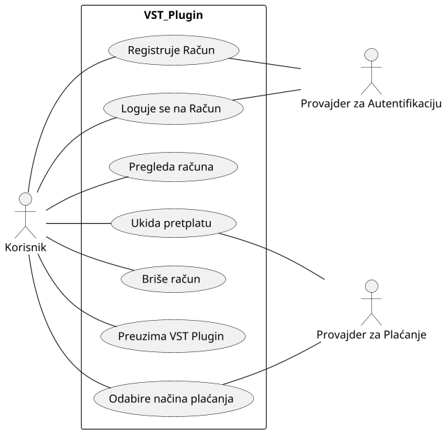
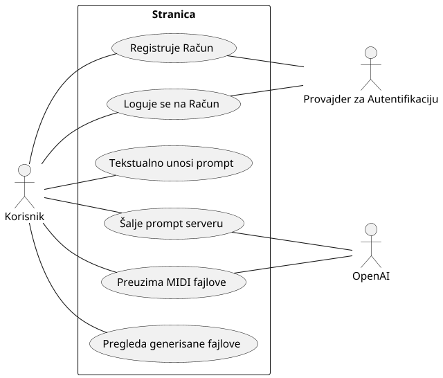

# 1. Use Case Dijagrami

## Korisnik | AI MIDI Generator

```plantuml
@startuml

scale 640 width

left to right direction
skinparam packageStyle rectangle
actor "Korisnik" as U
actor "Provajder za Autentifikaciju" as A
actor "Provajder za Plaćanje" as P
rectangle VST_Plugin {
  usecase "Registruje Račun" as Reg
  usecase "Loguje se na Račun" as Log
  usecase "Pregleda računa" as Preg
  usecase "Ukida pretplatu" as Ukida
  usecase "Briše račun" as Brise 
  usecase "Preuzima VST Plugin" as Preuzima
  usecase "Odabire načina plaćanja" as Odabir
}

U -- Reg
U -- Log
U -- Preg
U -- Ukida
U -- Brise
U -- Preuzima
U -- Odabir

Reg -- A
Log -- A
Odabir -- P
Ukida -- P

@enduml
```

## Korisnik | Stranica

```plantuml
@startuml

scale 640 width

left to right direction
skinparam packageStyle rectangle
actor "Korisnik" as U
actor "Provajder za Autentifikaciju" as A
actor "OpenAI" as O
rectangle Stranica {
  usecase "Registruje Račun" as Reg
  usecase "Loguje se na Račun" as Log
  usecase "Tekstualno unosi prompt" as Prompt
  usecase "Šalje prompt serveru" as Server
  usecase "Preuzima MIDI fajlove" as Preuzima
  usecase "Pregleda generisane fajlove" as Preg
}

U -- Reg
U -- Log
U -- Prompt
U -- Server
U -- Preuzima
U -- Preg

Reg -- A
Log -- A
Server -- O
Preuzima -- O

@enduml
```